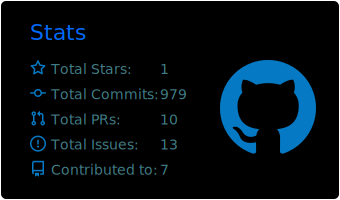
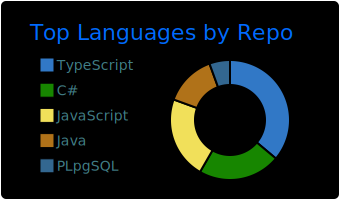

<h1 align="center">
    
</h1>

  <h3>Full-Stack Software Engineer | CS Graduate from University of Piraeus</h3>
  
Passionate about crafting beautiful, high-performance web applications and building robust backend systems.

  

---

### About Me

- **Computer Science Graduate** from the University of Piraeus.
- I’m currently working on exciting full-stack projects like **Vengo**, **Cinemi** and **School Library**.
- I’m currently deep-diving into  **Next.js, Tailwind CSS & React Server Components**, alongside  **Java Spring** & **Supabase**.
- Reach out to me: **[aggelossakell@gmail.com](mailto:aggelossakell@gmail.com)**
- Available for new opportunities to leverage my skills and contribute to exciting projects!

---

### Languages and Tools

 

  
   
  

---

### Featured Projects

- **[Vengo](https://vengo.vercel.app)** - A collaborative travel planning platform utilizing interactive map integration, real-time collaboration, and a centralized itinerary builder.
- **[Cinemi](https://cinemi.vercel.app)** - A Greek cinema discovery platform featuring live scraper data, mapping capabilities and user watchlists.
- **[School Library](https://5o-school-library.vercel.app)** - A complete platform that digitizes school library management allowing smart and multi-faceted book cataloguing & borrowing.
- **LikEat** - A secure web application with custom fair ranking evaluation functionality built via Java Spring Security.

---

### GitHub Stats

  
  
  

---

### Connect with Me

  
  

